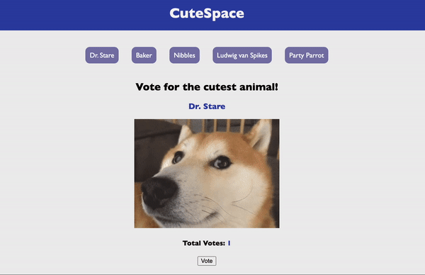

# JavaScript Project Guidelines

## Learning Goals

- Design and architect features across a frontend
- Integrate JavaScript and an external API
- Debug issues in small- to medium-sized projects
- Build and iterate on a project MVP

## Introduction

Welcome to the JavaScript Project!

You’ve worked so hard to get here and have learned a ton. Now it's time to bring
it all together!

For this project, you're going build a Single Page Application (**SPA**).
Building this application will be challenging because it will integrate
everything you've learned up to this point. Your frontend will be built with
HTML, CSS, and JavaScript and will communicate with a `json-server` mock backend.

### Project Requirements

1. Your app must be a HTML/CSS/JS frontend that accesses data from a mock backend 
   served with `json-server`. All interactions between the client and the backend 
   should be handled asynchronously and use JSON as the communication format. 

2. Your entire app must run on a single page. There should be NO redirects. In
   other words, your project will contain a single HTML file.

3. Use at least 1 unique [event-listener][] that enables interactivity. Think
   search or filter functionality, toggling dark/light mode, upvoting posts,
   etc.

4. Your project must implement at least one instance of array iteration using
   available array methods (`map`, `forEach`, `filter`, etc). Manipulating your
   backend data in some way should present an opportunity to implement your array
   iteration.

5. Follow good coding practices. Keep your code DRY (Do not repeat yourself) by
   utilizing functions to abstract repetitive code.

### Stretch Goals

If you achieve MVP early on and would like to give yourself a challenge, consider 
adding a stretch goal. Remember you only have a few hours to work on this project 
and be sure you have a completed MVP before attempting the following.

1. Use a free public API in your project. If you choose to do so, we recommend avoiding
API's that require a key or any sort of authorization. For ideas, see this [list of no-auth APIs](https://mixedanalytics.com/blog/list-actually-free-open-no-auth-needed-apis/). If you would 
still like to use an API that requires a key, please consult with your instructor on how to 
protect that key. **NEVER push your API key to github!**


## Strategy and Tips

### Planning

For this project, you will be given a local API served with `json-server` to build 
a frontend for. Your frontend should be built with HTML, CSS, and JavaScript and will
communicate with the given mock backend.

## CuteSpace

The project you will be building is an app for voting for the cutest animal. Use this gif as an example of how the app should work. 



> Your styling does not have to match what is shown in the above example. Feel free to add your own style! 

## Core Deliverables

When it comes to developing projects, a key concept to have in mind is the "Minimum Viable Product", or MVP for short. You should aim to meet the MVP requirements first. Doing so keeps your focus on completing a functional project first and foremost, avoiding any potential time loss on extraneous work. 

For this project, those requirements are listed below as user stories: 

**As a user, I can:** 

1. See each animal's name in a navigation bar. 
2. Click on each animal's name to display their vote count and photo. 
3. Click on a "Vote" button for a specific animal and immediately see their vote count increase. 
    - It should _not_ affect the amount of votes any other animal has. 
    - For MVP, the update vote count does _not_ need to persist once you refresh or navigate away from that animal.

## Setup 

To allow you to focus on writing code, we've provided you with some starter code and all the files you will need. Fork and clone down the attached repository to get started.

### The Files 

The three files you should be working in are:

1. `index.html` 
2. `style.css` 
3. `src/index.js` 

The HTML file includes the boilerplate and links to both the CSS and JavaScript files. 

### The Mock Backend 

We've also provided you with the mock database to work with. To get it started, use `json-server` by running the following command: 

```sh
json-server --watch db.json
``` 

Test your server by visiting this route in the browser: 

[http://localhost:3000/animals](http://localhost:3000/animals)

Once that's up and running, you're good to start coding! Note that the base URL for your API will be [http://localhost:3000](http://localhost:3000). 

## Bonus Deliverables 

The following deliverables are **not** required as part of this project's MVP and will **not** negatively affect your score if you do not attempt them. These are only here if you finish MVP early and want an extra challenge. Make sure you commit your work to save your progress before attempting the bonus deliverables!

**As a user, I can:** 

1. Click on a "Reset" button for a specific animal to reset their votes to 0. 
  - **Extra challenge:** Add a "Reset" button to reset _all_ animal's votes to 0. 
1. Click on a "Vote" button for a specific animal and have the updated vote count persist.
  - **Hint:** You will need to make a `PATCH` request to `/animals/:id`

## Resources

- [json-server][]

[json-server]: https://www.npmjs.com/package/json-server
[event-listeners]: https://developer.mozilla.org/en-US/docs/Web/Events